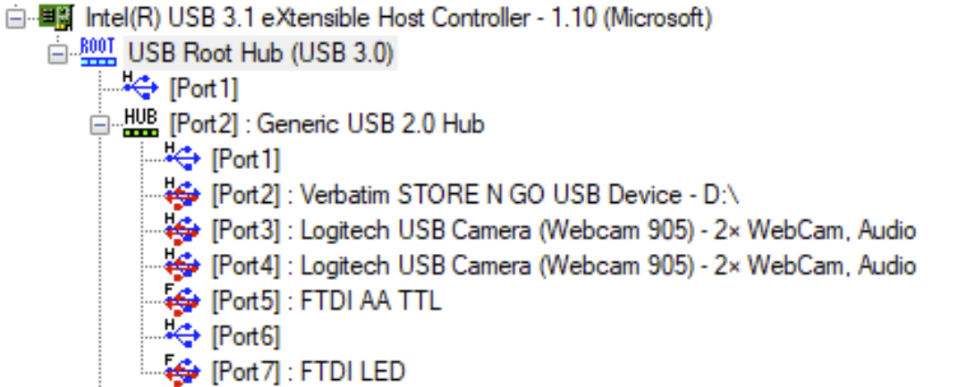
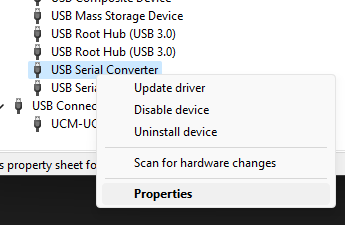
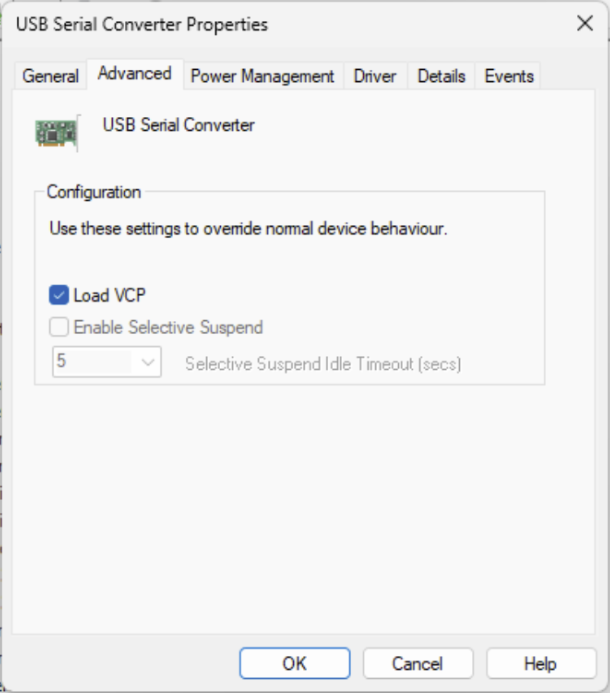

# Communicating with Andrew
The Andrew robot contains a USB Hub connected to all the different controllable components of the robot.

## Storage Device
A standard USB thumb drive is plugged into the Andrew board. This contains files with various configuration and hardware-specific details. One of the more important files in this drive is `andrew.xml`

## Webcams
These are standard USB webcams. Nothing special needs to be done to communicate with them.

## FTDI Serial Ports
These devices may not show up as COM ports by default, especially if the Andrew software has been installed. Resolving this is necessary for the library provided in this repository to function. To do this:
- Open Device Manager
- Locate the relevant "USB Serial Converter" devices\

- Open their Properties and go to the Advanced tab
- Check "Load VCP"\

This will force the serial ports to use the older VCP drivers, rather than FTDI's special D2XX (or maybe D3XX) drivers.
> Note that AndrewOS will no longer function with this change, but this can be easily reverted by unchecking Load VCP again

One serial device controls the lights for the robot. [More Details](LightControls.md)

The other serial device controls the servos for the robot. [More Details](Servos.md)