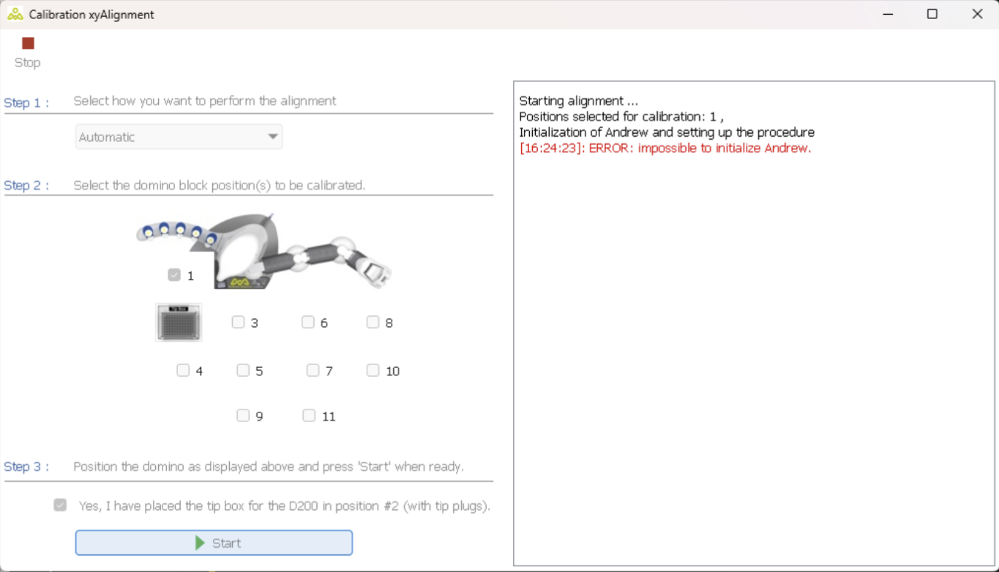
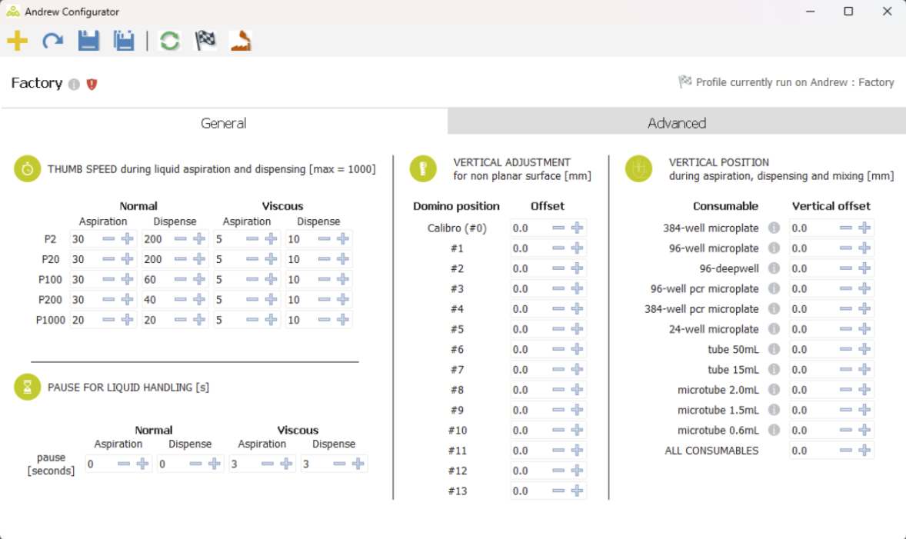

Andrew Alliance provides a solution to control the Andrew robot. This software is no longer receiving updates and uses outdated technology, which is part of the reason for this project.

## AndrewLab
AndrewLab is the design tool to create high-level lab procedures for the robot to follow. [Download](https://www.andrewalliance.com/wp-content/uploads/2020/01/andrewlab-1.5.8.air) \
AndrewLab requires [Adobe AIR](https://airsdk.harman.com/runtime) to run.

## AndrewOS
AndrewOS is the driver software to communicate with and control the robot. [Download](https://www.andrewalliance.com/AndrewOSInstaller.exe)

AndrewOS outputs detailed log files to `C:\Program Files (x86)\AndrewOS\Logfiles`. These contain detailed information about all the steps the software takes, and the organization of the code. This was especially helpful for reverse engineering certain aspects of the robot.

An example log can be found [here](https://gist.github.com/Brokemia/23c5ca8ca51a3b0f30b487e3e2846043)

AndrewOS comes with a number of different programs, most of which are meant to be used for support and debugging.

### AndrewCalibration.exe
This tool appears to be for calibrating the positions of dominos relative to the robot. It requires a username and password to open, which were found through using Ghidra to decompile the code.

Username: andrew \
Password: 15032011

### AndrewConfigurator.exe
This tool appears to be for adjusting various constants about the robot. All of the configuration files are stored on the flash drive inside Andrew. This requires the same username and password as AndrewCalibration.exe.

Username: andrew \
Password: 15032011

